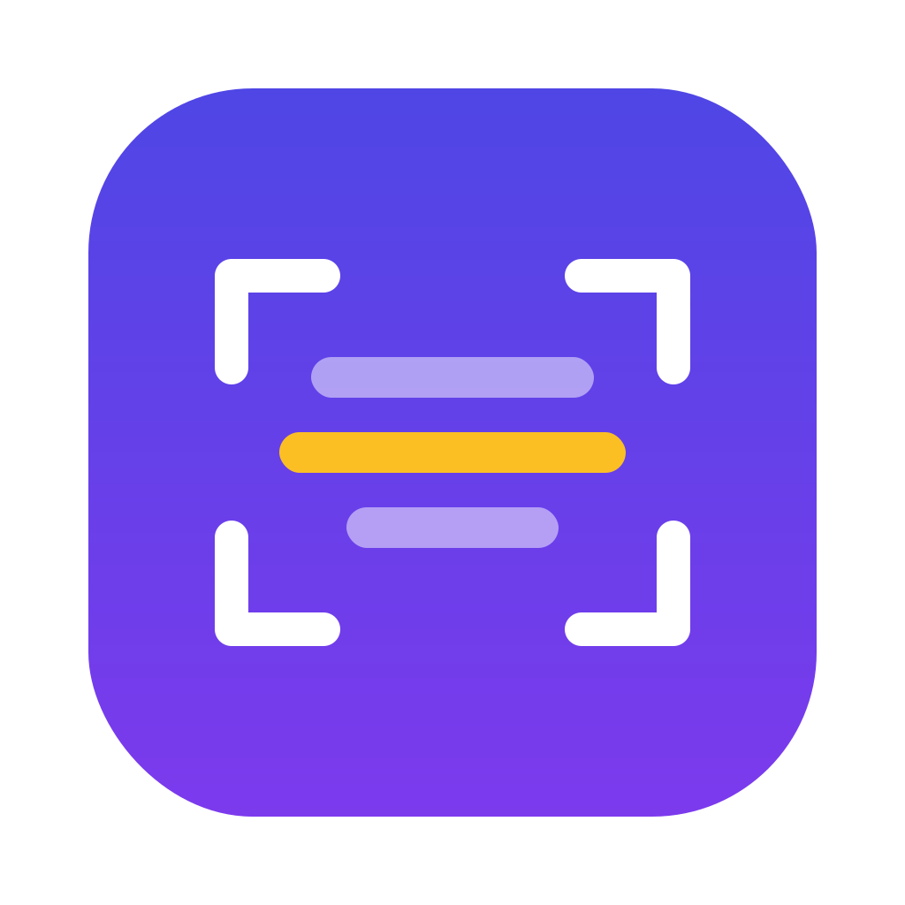

<p align="center">
  
  <h1 align="center">Readly</h1>
</p>

<h3 align="center">Press a hotkey, drag a region, get the text — fully on-device</h3>

<p align="center">
  
  
  
</p>

Readly is a native macOS menu bar utility. Press a global hotkey, drag a
rectangle over anything on screen, and the text inside is recognized and
copied to your clipboard — no windows, no saved files, no cloud.

## How it works

1. Press **⇧⌘2** (rebindable)
2. The screen dims and the cursor becomes a crosshair — drag over anything:
   an image, a video frame, a dialog, a PDF scan, non-selectable text
3. Text is recognized on-device and copied to the clipboard; a brief HUD
   confirms it

## Privacy

Everything happens on this Mac: ScreenCaptureKit for capture, Apple's Vision
framework for OCR. Readly makes no network requests and keeps no history —
nothing is ever uploaded anywhere.

## Requirements

- macOS 14+ on Apple Silicon
- Screen Recording access (see [Permissions](#permissions))

## Install

Build from source:

```bash
git clone https://github.com/mberrishdev/Readly.git
cd Readly
open Readly.xcodeproj   # ⌘R
```

Or headless:

```bash
xcodebuild -project Readly.xcodeproj -scheme Readly -configuration Debug build
```

Run the tests:

```bash
xcodebuild test -project Readly.xcodeproj -scheme Readly -destination 'platform=macOS'
```

## Using it

| Action | Gesture |
|---|---|
| Capture text | Press **⇧⌘2**, drag a selection |
| Cancel a selection | Press the hotkey again, or **Esc** |
| Everything else | Menu bar icon → Settings |

The hotkey is rebindable in **Settings → Shortcut**.

## Permissions

Readly needs Screen Recording access to capture the area you select. A
first-launch onboarding window walks through granting it, rather than a cold
system prompt firing off your first hotkey press.

macOS may show **two** dialogs — approve both:

1. The classic Screen Recording toggle
2. A newer one confirming Readly captures your selection directly, instead of
   through the system's window picker (Readly's own selection overlay
   replaces that picker)

## Architecture

Readly is a pipeline, not an app with screens:

```
Hotkey → Selection overlay → Screen capture → OCR (Vision) → Clipboard + HUD
```

One coordinator (`CaptureCoordinator`) executes the effects of a small, pure,
unit-tested state machine (`CaptureFlowMachine`); everything else is a dumb
service it calls in order.

- `App/` — composition root, menu bar, onboarding
- `Coordinator/` — the state machine and the coordinator driving it
- `Overlay/` — the selection window and the Cocoa/display/pixel coordinate math
- `Services/` — hotkey, capture (ScreenCaptureKit), OCR (Vision), output
  (clipboard + HUD), permissions
- `Settings/` — the settings window and its preferences store
- `ReadlyTests/` — coordinate math and flow/re-entrancy rules, pinned with
  Swift Testing

## Roadmap

- Language auto-detection
- Capture history
- Table detection → paste as CSV
- Translate after capture

## License

[MIT](LICENSE)
